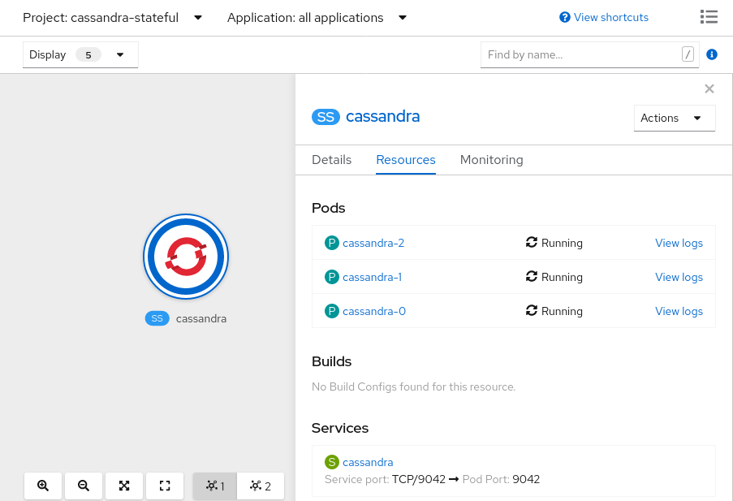

# oadp-capstone

# Step 5
## Installing a complex Application
In this step we will walkthrough the steps of installing a complex application
that will be used to demonstration the use of velero in a backup and restore scenario.

Available Applications
* Cassandra
* Postgres HA (Patroni)  

**Installing Cassandra**  
Please follow the link below for installing Cassandra.  
Running *ansible-playbook install.yaml* should set everything up.  

[Cassandra Example](https://github.com/konveyor/velero-examples/tree/master/cassandra "Cassandra")

End results should look like the following in openshift

Output should also have the looking when running the command `oc get all -n cassandra-stateful`
<pre>pod/cassandra-0   1/1     Running   0          6d1h
pod/cassandra-1   1/1     Running   0          6d1h
pod/cassandra-2   1/1     Running   0          6d1h

NAME                TYPE        CLUSTER-IP   EXTERNAL-IP   PORT(S)    AGE
service/cassandra   ClusterIP   None         &lt;none&gt;        9042/TCP   6d1h

NAME                         READY   AGE
statefulset.apps/cassandra   3/3     6d1h
</pre>

# Step 6
## Performing a backup
Now that we have a complex application on openshift, we can demonstrate a backup on the application.  
Click the link based on which application was installed.

- [Cassandra](#cassandra-app)  
- [Postgres HA](#postgres-app)

## Cassandra App
For cassandra, all we need to do to perform the backup is running the command `ansible-playbook backup.yaml`

This will do a few things.
* Velero hooks containing commands are executing to stop writes pre-backup and start again post-backup.
* Application is also quiesced just before backup.
* Backup will then be created.

The Cassandra backup can be checked by running `velero get backups`  
Output showing Cassandra in the backup should look like the following below

## Postgres App

# Step 7
## Showing Backup Data in Noobaa S3 Bucket

# Step 8
## Simulating a disaster scenario
A disaster scenario of deleting the namespace will be performed to show that the restore functionalty of velero works.

Pick which app that a backup was performed with.
- [Deleting Cassandra](#deleting-cassandra)  

## Deleting Cassandra
First make sure Step 6 was performed and a Backup of Cassandra exists `velero get backups`.

Then following the [Cassandra Example](https://github.com/konveyor/velero-examples/tree/master/cassandra "Cassandra"), run the
command `ansible-playbook delete.yaml` which will delete Cassandra and perform the disaster scenario.
Output should look like the following below. Results should also show the cassandra namespace being terminated and then deleting from openshift.

