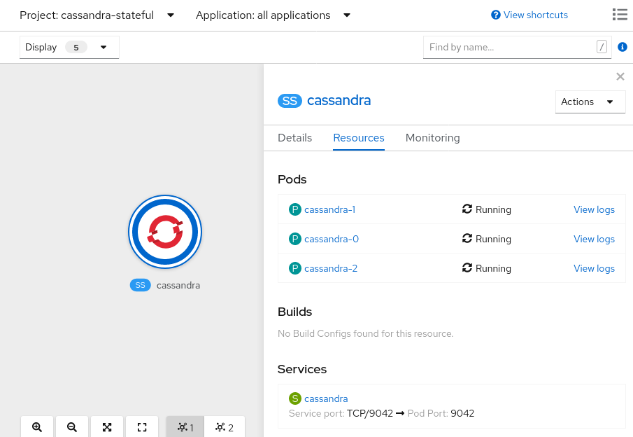
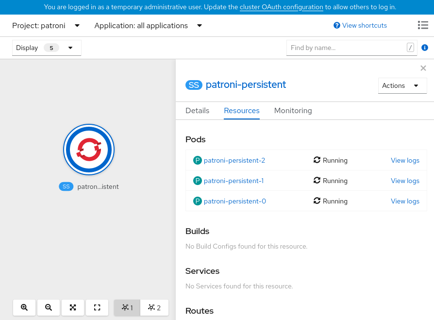
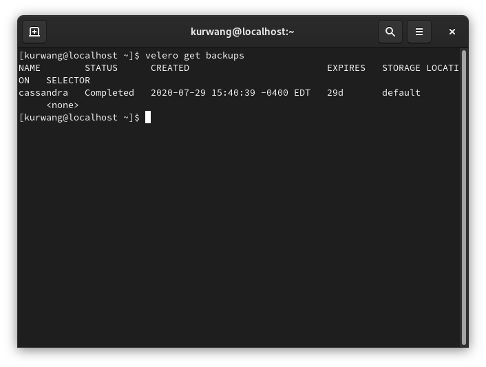
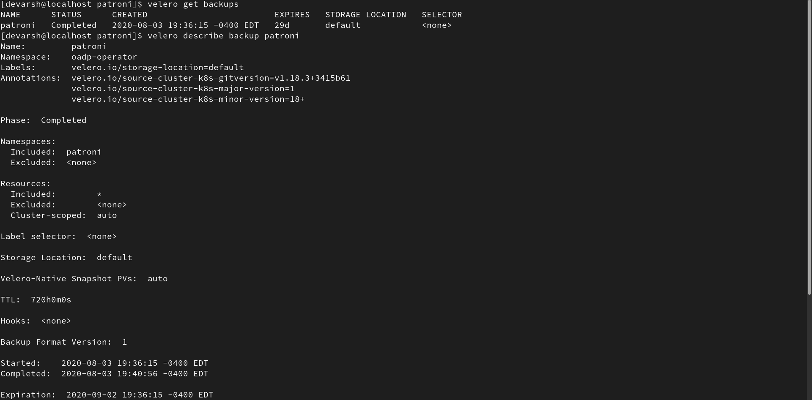
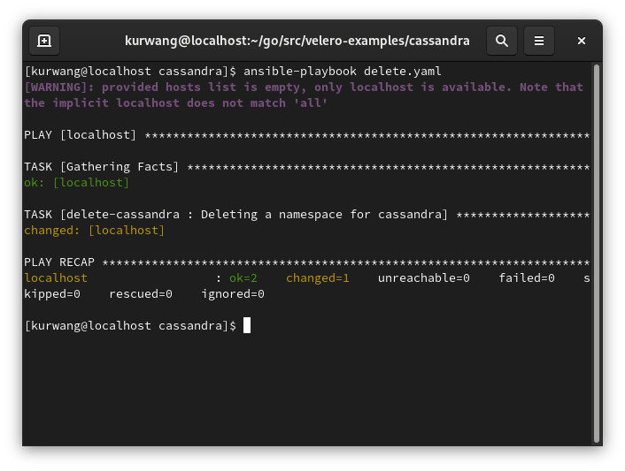
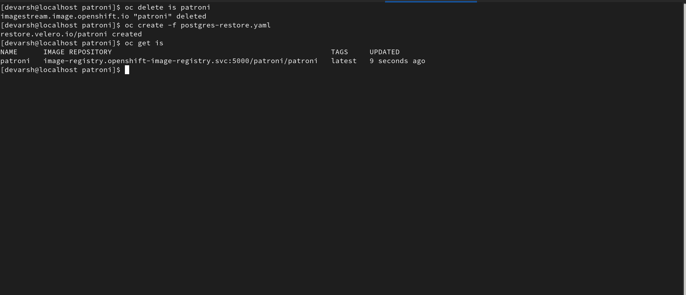
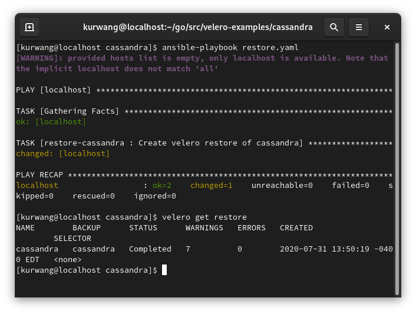
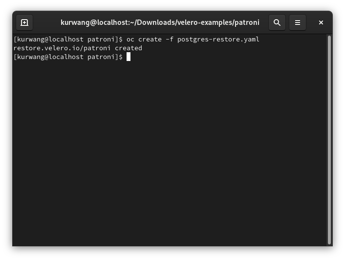

# oadp-capstone

# Step 1: Add OADP Operator to OLM

Clone the OADP Operator repository:
```
git clone https://github.com/konveyor/oadp-operator
```

Create an `oadp-operator-source.yaml` file like below in oadp-operator directory:

<b>Note:</b> Change the `registryNamespace` and `publisher` fields.
```
apiVersion: operators.coreos.com/v1
kind: OperatorSource
metadata:
  name: oadp-operator
  namespace: openshift-marketplace
spec:
  type: appregistry
  endpoint: https://quay.io/cnr
  registryNamespace: deshah
  displayName: "OADP Operator"
  publisher: "deshah@redhat.com"
```

Run the following commands (note: they should be run from the root of the oadp-operator directory):

```
oc create namespace oadp-operator
oc project oadp-operator
oc create secret generic <SECRET_NAME> --namespace oadp-operator --from-file cloud=<CREDENTIALS_FILE_PATH>
oc create -f oadp-operator-source.yaml
```

Remove the deployed resources:

- Delete any CRD instances created inside the operator from operatorhub console.


- Uninstall the OADP operator from the namespace.


# Step 2: Install OADP Operator from OperatorHub

Navigate to the OpenShift console in your web browser. Under the Administrator view, go to Operators on the left tab and click on OperatorHub. Search for the OADP Operator in the search bar. Click on it to install and subscribe to the operator. 


If you go to Installed Operators and select the oadp-operator project, you should see the OADP Operator successfully installed:


# Step 3: Install OCS from OperatorHub

Navigate to the OpenShift console. Under the Administrator view, go to Operators on the left tab and click on OperatorHub. Search for the OpenShift Container Storage operator in the search bar. Click on it to install and subscribe to the operator. Make sure to install it under the oadp-operator namespace. 


If you go to Installed Operators and select the openshift-operator project, you should see the OpenShift Container Storage operator successfully installed:


# Step 4: Create a Velero Custom Resource to Install Velero, Restic, and Noobaa

In order to use OLM for OADP deployment, you need to change flag `olm_managed` in the `konveyor.openshift.io_v1alpha1_velero_cr.yaml` to `true`. The file is present in deploy/crds folder.

Moreover, to use Nooba, in the `konveyor.openshift.io_v1alpha1_velero_cr.yaml`, you need to:  

1. Set the flag `noobaa` to `true`.
2. Set the volume snapshot location region to the correct value. 

For instance the `konveyor.openshift.io_v1alpha1_velero_cr.yaml` file might look something like this:

```
apiVersion: konveyor.openshift.io/v1alpha1
kind: Velero
metadata:
  name: example-velero
spec:
  use_upstream_images: true
  olm_managed: true
  noobaa: true
  default_velero_plugins:
  - aws
  enable_restic: true
```

To enable openshift-velero-plugin along with velero installation, `default_velero_plugin` should be:

```
default_velero_plugins:
  - aws
  - openshift
```

When the installation succeeds, create a Velero CR
```
oc create -f deploy/crds/konveyor.openshift.io_v1alpha1_velero_cr.yaml
```

Post completion of all the above steps, you can check if the operator was successfully installed; the expected result for the command `oc get all -n oadp-operator` is as follows:
```
NAME                                      READY   STATUS    RESTARTS   AGE
pod/aws-s3-provisioner-6cdf54b89-8nz7l    1/1     Running   0          162m
pod/noobaa-core-0                         1/1     Running   2          160m
pod/noobaa-db-0                           1/1     Running   0          160m
pod/noobaa-endpoint-7f4bcfb665-wmfhf      1/1     Running   0          156m
pod/noobaa-operator-7b79bf7c68-wz5jc      1/1     Running   0          163m
pod/oadp-operator-69fc6bfcb4-xjn2l        1/1     Running   1          161m
pod/ocs-operator-7b564dc46f-hzh8g         1/1     Running   0          163m
pod/rook-ceph-operator-6f985689b4-t95k4   1/1     Running   0          163m

NAME                            TYPE           CLUSTER-IP       EXTERNAL-IP                                                               PORT(S)                                                    AGE
service/noobaa-db               ClusterIP      172.30.29.6      <none>                                                                    27017/TCP                                                  160m
service/noobaa-mgmt             LoadBalancer   172.30.222.31    a1276fa043dc5469caaa9f6b566b5091-1561678137.us-west-1.elb.amazonaws.com   80:31438/TCP,443:31408/TCP,8445:32375/TCP,8446:31952/TCP   160m
service/oadp-operator-metrics   ClusterIP      172.30.171.159   <none>                                                                    8383/TCP,8686/TCP                                          161m
service/s3                      LoadBalancer   172.30.184.59    aebf6dedc595e489496daaeb74c65f12-400970079.us-west-1.elb.amazonaws.com    80:31321/TCP,443:30213/TCP,8444:32073/TCP                  160m

NAME                                 READY   UP-TO-DATE   AVAILABLE   AGE
deployment.apps/aws-s3-provisioner   1/1     1            1           163m
deployment.apps/noobaa-endpoint      1/1     1            1           156m
deployment.apps/noobaa-operator      1/1     1            1           163m
deployment.apps/oadp-operator        1/1     1            1           161m
deployment.apps/ocs-operator         1/1     1            1           163m
deployment.apps/rook-ceph-operator   1/1     1            1           163m

NAME                                            DESIRED   CURRENT   READY   AGE
replicaset.apps/aws-s3-provisioner-5dd8cccfd8   0         0         0       163m
replicaset.apps/aws-s3-provisioner-6cdf54b89    1         1         1       162m
replicaset.apps/noobaa-endpoint-7f4bcfb665      1         1         1       156m
replicaset.apps/noobaa-operator-7b79bf7c68      1         1         1       163m
replicaset.apps/oadp-operator-69fc6bfcb4        1         1         1       161m
replicaset.apps/ocs-operator-7b564dc46f         1         1         1       163m
replicaset.apps/rook-ceph-operator-6f985689b4   1         1         1       163m

NAME                           READY   AGE
statefulset.apps/noobaa-core   1/1     160m
statefulset.apps/noobaa-db     1/1     160m

NAME                                                  REFERENCE                    TARGETS   MINPODS   MAXPODS   REPLICAS   AGE
horizontalpodautoscaler.autoscaling/noobaa-endpoint   Deployment/noobaa-endpoint   0%/80%    1         1         1          156m

NAME                                   HOST/PORT                                                                PATH   SERVICES      PORT         TERMINATION   WILDCARD
route.route.openshift.io/noobaa-mgmt   noobaa-mgmt-oadp-operator.apps.cluster-dlu-4-5.dlu-4-5.mg.dog8code.com          noobaa-mgmt   mgmt-https   reencrypt     None
route.route.openshift.io/s3            s3-oadp-operator.apps.cluster-dlu-4-5.dlu-4-5.mg.dog8code.com                   s3            s3-https     reencrypt     None
```

Also, `oc get noobaa` should give:
```
NAME     MGMT-ENDPOINTS                 S3-ENDPOINTS                   IMAGE                                                                                                            PHASE   AGE
noobaa   [https://10.0.185.183:31408]   [https://10.0.185.183:30213]   registry.redhat.io/ocs4/mcg-core-rhel8@sha256:689c5a109b81190ddc507b17b7b44ae00029951e7e2c80a6e33358a53945dab6   Ready   161m
```
<b>Note:</b> Please refer the following documentation for more information regarding OADP Operator with NooBaa install, debugging scenarios and cleanup. 

[Install OADP Operator and use NooBaa as a BackupStoraeLocation](docs/noobaa/install_oadp_noobaa.md) 

[NooBaa debugging scenarios](docs/noobaa/debug_noobaa.md)

[Cleanup OADP Operator with NooBaa](docs/noobaa/cleanup_oadp_noobaa.md)

# Step 5 - Installing a Complex Application

In this step we will walkthrough the steps of installing a complex application that will be used to demonstration the use of velero in a backup and restore scenario.

Available Applications

* [Cassandra](#installing-cassandra) 
* [Postgres](#installing-postgres) 

## Installing Cassandra

Please follow the link below for installing Cassandra.  

Running `ansible-playbook install.yaml` should set everything up.  

[Cassandra Example](https://github.com/konveyor/velero-examples/tree/master/cassandra "Cassandra")

End results should look like the following in OpenShift:



The output should also have the following when running the command `oc get all -n cassandra-stateful`:
```
pod/cassandra-0   1/1     Running   0          6d1h
pod/cassandra-1   1/1     Running   0          6d1h
pod/cassandra-2   1/1     Running   0          6d1h

NAME                TYPE        CLUSTER-IP   EXTERNAL-IP   PORT(S)    AGE
service/cassandra   ClusterIP   None         &lt;none&gt;        9042/TCP   6d1h

NAME                         READY   AGE
statefulset.apps/cassandra   3/3     6d1h
```

## Installing Postgres

Please follow this link for installing Postgres: [Postgres example](https://github.com/devarshshah15/velero-examples/tree/debug/patroni "Postgres").

Running all the commands to install patroni will give results like the following:



Output should also have the looking when running the command `oc get all -n patroni`:
```
NAME                       READY   STATUS    RESTARTS   AGE
pod/patroni-persistent-0   1/1     Running   0          6d4h
pod/patroni-persistent-1   1/1     Running   0          6d4h
pod/patroni-persistent-2   1/1     Running   0          6d4h
pod/pgbench                1/1     Running   0          6d4h

NAME                                 TYPE        CLUSTER-IP       EXTERNAL-IP   PORT(S)    AGE
service/patroni-persistent           ClusterIP   172.30.146.208   &lt;none&gt;        5432/TCP   6d4h
service/patroni-persistent-master    ClusterIP   172.30.44.10     &lt;none&gt;        5432/TCP   6d4h
service/patroni-persistent-replica   ClusterIP   172.30.111.87    &lt;none&gt;        5432/TCP   6d4h

NAME                                  READY   AGE
statefulset.apps/patroni-persistent   3/3     6d4h
```
## Logging and populating database
To get the service IPs of the PostgreSQL cluster, run:

```
$ oc get svc
NAME                         TYPE        CLUSTER-IP      EXTERNAL-IP   PORT(S)    AGE
patroni-persistent           ClusterIP   172.30.88.252   <none>        5432/TCP   20h
patroni-persistent-master    ClusterIP   172.30.51.69    <none>        5432/TCP   20h
patroni-persistent-replica   ClusterIP   172.30.0.120    <none>        5432/TCP   20h
```

<b>Note:</b> You can use the patroni-persistent-master service to establish a read/write connection 
while the patroni-persistent-replica service can be used to establish a read only connection.

We are logging into PostgreSQL from the pgbench pod. The password for logging in is `postgres`.
```
oc rsh pgbench
psql -U postgres -h 172.30.51.69
```

To create a table and populate data in it, run the following
```
postgres=> CREATE TABLE TEMP(id INTEGER PRIMARY KEY, name VARCHAR(10));
postgres=> INSERT INTO TEMP VALUES(1,'alex');
```

To check if the data was populated do
```
postgres=> SELECT * FROM TEMP;
```
The output of the table should look like this
```
 id | name 
----+------
  1 | alex

```

# Step 6 - Performing a backup

Now that we have a complex application on OpenShift, we can demonstrate a backup on the application.  

Click the link based on which application was installed.

- [Cassandra](#cassandra-app)  
- [Postgres HA](#postgres-app)

## Cassandra App
First before our backup, lets populate our database in Cassandra with some sample data.  
Run the commands in the following order. This will access the shell and populate some data. 
<pre>
oc exec -it cassandra-0 -- cqlsh
CREATE KEYSPACE classicmodels WITH REPLICATION = { 'class' : 'SimpleStrategy', 'replication_factor' : 3 };
use classicmodels;
CREATE TABLE offices (officeCode text PRIMARY KEY, city text, phone text, addressLine1 text, addressLine2 text, state text, country text, postalCode text, territory text);
INSERT into offices(officeCode, city, phone, addressLine1, addressLine2, state, country ,postalCode, territory) values
('1','San Francisco','+1 650 219 4782','100 Market Street','Suite 300','CA','USA','94080','NA');
</pre>

Optional: You can use `SELECT * FROM classicmodels.offices;` to check that your sample data is entered correctly.

Last exit the shell to move onto the backup.

Now for the backup, all we need to do to perform the backup is running the command `ansible-playbook backup.yaml`.

Backup will look like the following with the nodetool operations being called in cassandra.
<pre>
    Disable Gossip (Stops communication with other nodes)
    Disable Thrift (Stops communication with one of the two protocols for listening to client)
    Disable Binary (Stops communication with the other protocol for listening to client)
    Nodetool flush is called to flush all memory to disk
    Perform Backup
    Enable Gossip, Thrift, and Binary (Start listening to connections again)
</pre>

Velero hooks look like this
<pre>
pre.hook.backup.velero.io/command: '["/bin/bash", "-c", "opt/cassandra/bin/nodetool disablegossip && opt/cassandra/bin/nodetool disablethrift && opt/cassandra/bin/nodetool disablebinary && opt/cassandra/bin/nodetool flush"]'
post.hook.backup.velero.io/command: '["/bin/bash", "-c", "opt/cassandra/bin/nodetool enablegossip && opt/cassandra/bin/nodetool enablethrift && opt/cassandra/bin/nodetool enablebinary"]'
</pre>

The Cassandra backup can be checked by running `velero get backups`.

Output showing Cassandra in the backup should look like the following:



Output showing description of backup using `velero describe backup`  
Note: This backup is using restic because vsl was not configured.  
Used opt-in approach. Annotate Pod with the following.  
`kubectl -n YOUR_POD_NAMESPACE annotate pod/YOUR_POD_NAME backup.velero.io/backup-volumes=YOUR_VOLUME_NAME_1,YOUR_VOLUME_NAME_2,...`
<pre>
Name:         cassandra
Namespace:    oadp-operator
Labels:       velero.io/storage-location=default
Annotations:  velero.io/source-cluster-k8s-gitversion=v1.17.1
              velero.io/source-cluster-k8s-major-version=1
              velero.io/source-cluster-k8s-minor-version=17+

Phase:  Completed

Namespaces:
  Included:  cassandra-stateful
  Excluded:  &lt;none&gt;

Resources:
  Included:        *
  Excluded:        &lt;none&gt;
  Cluster-scoped:  auto

Label selector:  &lt;none&gt;

Storage Location:  default

Snapshot PVs:  auto

TTL:  720h0m0s

Hooks:  &lt;none&gt;

Backup Format Version:  1

Started:    2020-08-05 15:29:29 -0400 EDT
Completed:  2020-08-05 15:31:36 -0400 EDT

Expiration:  2020-09-04 15:29:29 -0400 EDT

Resource List:
  apps/v1/ControllerRevision:
    - cassandra-stateful/cassandra-7f6dd487c4
  apps/v1/StatefulSet:
    - cassandra-stateful/cassandra
  authorization.openshift.io/v1/RoleBinding:
    - cassandra-stateful/system:deployers
    - cassandra-stateful/system:image-builders
    - cassandra-stateful/system:image-pullers
  rbac.authorization.k8s.io/v1/RoleBinding:
    - cassandra-stateful/system:deployers
    - cassandra-stateful/system:image-builders
    - cassandra-stateful/system:image-pullers
  v1/Endpoints:
    - cassandra-stateful/cassandra
  v1/Event:
    - cassandra-stateful/cassandra-0.162864baf6d28fab
    - cassandra-stateful/cassandra-0.162864bcd951d606
    - cassandra-stateful/cassandra-0.162864bcf2313a6b
    - cassandra-stateful/cassandra-0.162864bd16274de5
    - cassandra-stateful/cassandra-0.162864bd1b3084c6
    - cassandra-stateful/cassandra-1.1628648122760fc3
    - cassandra-stateful/cassandra-1.1628648e6bfc1f12
    - cassandra-stateful/cassandra-1.162864cdc171b9a3
    - cassandra-stateful/cassandra-1.162864cddc6ccce5
    - cassandra-stateful/cassandra-1.162864ce0a07b2f1
    - cassandra-stateful/cassandra-1.162864ce13ffce3a
    - cassandra-stateful/cassandra-2.162864baf6d22579
    - cassandra-stateful/cassandra-2.162864bcc8b8da2b
    - cassandra-stateful/cassandra-2.162864bcf2327934
    - cassandra-stateful/cassandra-2.162864bd15748bd6
    - cassandra-stateful/cassandra-2.162864bd1b348408
  v1/Namespace:
    - cassandra-stateful
  v1/PersistentVolume:
    - pvc-3efd688e-96e8-4bf4-8d2e-38548ac06c91
    - pvc-91431776-ccf1-42f4-a88c-7d0eb4c8298d
    - pvc-cf82ea3c-c545-42ec-a7c1-ced47ea557e5
  v1/PersistentVolumeClaim:
    - cassandra-stateful/cassandra-data-cassandra-0
    - cassandra-stateful/cassandra-data-cassandra-1
    - cassandra-stateful/cassandra-data-cassandra-2
  v1/Pod:
    - cassandra-stateful/cassandra-0
    - cassandra-stateful/cassandra-1
    - cassandra-stateful/cassandra-2
  v1/Secret:
    - cassandra-stateful/builder-dockercfg-qtvlk
    - cassandra-stateful/builder-token-9nf7b
    - cassandra-stateful/builder-token-njwp5
    - cassandra-stateful/default-dockercfg-f5wdd
    - cassandra-stateful/default-token-dhnvg
    - cassandra-stateful/default-token-jgsx8
    - cassandra-stateful/deployer-dockercfg-7gz2z
    - cassandra-stateful/deployer-token-92snh
    - cassandra-stateful/deployer-token-zgzw9
  v1/Service:
    - cassandra-stateful/cassandra
  v1/ServiceAccount:
    - cassandra-stateful/builder
    - cassandra-stateful/default
    - cassandra-stateful/deployer

Persistent Volumes: &lt;none included&gt;

Restic Backups:
  Completed:
    cassandra-stateful/cassandra-0: cassandra-data
</pre>

## Postgres App

[Detailed Directions](https://github.com/devarshshah15/velero-examples/tree/debug/patroni#quiescing-the-database "Postgres")

Velero hooks enable the execution of terminal commands before and after resources are backed up. 
Before a backup, "pre" hooks are used to freeze resources, so that they are not modified as the backup is taking place. 
After a backup, "post" hooks are used to unfreeze those resources so so they can accept new transactions.


These lines specify the "pre" hook to freeze resources:

The container specifies where the command should be executed. Patronictl pause stops down the patroni cluster and pg_ctl stop shuts down the server running in the specified data directory.
```
pre.hook.backup.velero.io/command: '["/bin/bash", "-c","patronictl pause && pg_ctl stop -D pgdata/pgroot/data"]'
pre.hook.backup.velero.io/container: patroni-persistent
```

These lines specify the "post" hook to unfreeze them:

The container specifies where the command should be executed. Patronictl resume starts up the patroni cluster.
```
post.hook.backup.velero.io/command: '["/bin/bash", "-c", "patronictl resume"]'
post.hook.backup.velero.io/container: patroni-persistent
```

Then we can run `oc create -f postgres-backup.yaml` to create the backup itself.





Then run `oc get volumesnapshotcontent` and make sure the output looks similar to the one below.
```
$ oc get volumesnapshotcontent
NAME                                                              READYTOUSE   RESTORESIZE   DELETIONPOLICY   DRIVER                       VOLUMESNAPSHOTCLASS       VOLUMESNAPSHOT                                         AGE
snapcontent-24ef293e-68b1-4f01-8d9b-673d20c6b423                  true         5368709120    Retain           rook-ceph.rbd.csi.ceph.com   csi-rbdplugin-snapclass   velero-patroni-persistent-patroni-persistent-0-6l8rf   46m
snapcontent-bea37537-a585-4c5d-a02d-ce1067f067a8                  true         5368709120    Retain           rook-ceph.rbd.csi.ceph.com   csi-rbdplugin-snapclass   velero-patroni-persistent-patroni-persistent-2-hk4pk   45m
snapcontent-c0e5a49b-e5d8-4235-8f90-96f2eedf2d04                  true         5368709120    Retain           rook-ceph.rbd.csi.ceph.com   csi-rbdplugin-snapclass   velero-patroni-persistent-patroni-persistent-1-q7nj6   46m
snapcontent-d1104635-17d9-4c83-82e4-94032b31054e                  true         2147483648    Retain           rook-ceph.rbd.csi.ceph.com   csi-rbdplugin-snapclass   velero-patroni-8gx2g                                   44m
```
    
# Step 7 - Showing Backup Data in Noobaa S3 Bucket

# Step 8 - Simulating a disaster scenario

A disaster scenario of deleting the namespace will be performed to show that the restore functionalty of velero works.

Pick which app that a backup was performed with.

- [Deleting Cassandra](#deleting-cassandra)  
- [Deleting Postgres](#deleting-postgres)  

## Deleting Cassandra

First make sure Step 6 was performed and a Backup of Cassandra exists `velero get backups`.

Then following the [Cassandra Example](https://github.com/konveyor/velero-examples/tree/master/cassandra "Cassandra"), run the
command `ansible-playbook delete.yaml` which will delete Cassandra and perform the disaster scenario.

The output should look like the following. Results should also show the Cassandra namespace being terminated and then deleting from OpenShift:



## Deleting Postgres

First make sure Step 6 was performed and a Backup of Cassandra exists `velero get backups`.

Next we can safely create a disaster scenario and safely delete the namespace.

Run `oc delete namespace patroni` to delete the namespace.

Results should look like the following:


Delete image from internal registry and PV data once backup is completed. Restore the backup to see if internal registry image and PV data gets created:




# Step 9 - Restore Application and Demonstrate OCP Plugin Specifics

We can now move onto restoring the application after the disaster scenario. 

Pick which app that a backup was performed with.
- [Restoring Cassandra](#restoring-cassandra)  
- [Restoring Postgres](#restoring-postgres)  

## Restoring Cassandra

Restoring Cassandra by simply running `ansible-playbook restore`. This restore should look like:

Should look like the following.


Now run `velero describe restore cassandra --details` to check the data being restored and the restore as complete.
<pre>
Name:         cassandra
Namespace:    oadp-operator
Labels:       &lt;none&gt;
Annotations:  &lt;none&gt;

Phase:  Completed

Backup:  cassandra

Namespaces:
  Included:  *
  Excluded:  &lt;none&gt;

Resources:
  Included:        *
  Excluded:        nodes, events, events.events.k8s.io, backups.velero.io, restores.velero.io, resticrepositories.velero.io
  Cluster-scoped:  auto

Namespace mappings:  &lt;none&gt;

Label selector:  &lt;none&gt;

Restore PVs:  true

Restic Restores:
  Completed:
    cassandra-stateful/cassandra-0: cassandra-data
</pre>

## Restoring Postgres

Restoring Postgres by running `oc create -f postgres-restore.yaml`. The output should show:



Check the DB data after restore


Then check the CSI snapshots were created after restore.
```
$ oc get volumesnapshotcontent
NAME                                                              READYTOUSE   RESTORESIZE   DELETIONPOLICY   DRIVER                       VOLUMESNAPSHOTCLASS       VOLUMESNAPSHOT                                         AGE
snapcontent-24ef293e-68b1-4f01-8d9b-673d20c6b423                  true         5368709120    Retain           rook-ceph.rbd.csi.ceph.com   csi-rbdplugin-snapclass   velero-patroni-persistent-patroni-persistent-0-6l8rf   46m
snapcontent-bea37537-a585-4c5d-a02d-ce1067f067a8                  true         5368709120    Retain           rook-ceph.rbd.csi.ceph.com   csi-rbdplugin-snapclass   velero-patroni-persistent-patroni-persistent-2-hk4pk   45m
snapcontent-c0e5a49b-e5d8-4235-8f90-96f2eedf2d04                  true         5368709120    Retain           rook-ceph.rbd.csi.ceph.com   csi-rbdplugin-snapclass   velero-patroni-persistent-patroni-persistent-1-q7nj6   46m
snapcontent-d1104635-17d9-4c83-82e4-94032b31054e                  true         2147483648    Retain           rook-ceph.rbd.csi.ceph.com   csi-rbdplugin-snapclass   velero-patroni-8gx2g                                   44m
velero-velero-patroni-8gx2g-hhgd2                                 true         0             Retain           rook-ceph.rbd.csi.ceph.com   csi-rbdplugin-snapclass   velero-patroni-8gx2g                                   40m
velero-velero-patroni-persistent-patroni-persistent-0-6l8rcppgv   true         0             Retain           rook-ceph.rbd.csi.ceph.com   csi-rbdplugin-snapclass   velero-patroni-persistent-patroni-persistent-0-6l8rf   17m
velero-velero-patroni-persistent-patroni-persistent-1-q7njpv44s   true         0             Retain           rook-ceph.rbd.csi.ceph.com   csi-rbdplugin-snapclass   velero-patroni-persistent-patroni-persistent-1-q7nj6   17m
velero-velero-patroni-persistent-patroni-persistent-2-hk4pv8mgz   true         0             Retain           rook-ceph.rbd.csi.ceph.com   csi-rbdplugin-snapclass   velero-patroni-persistent-patroni-persistent-2-hk4pk   17m
```


